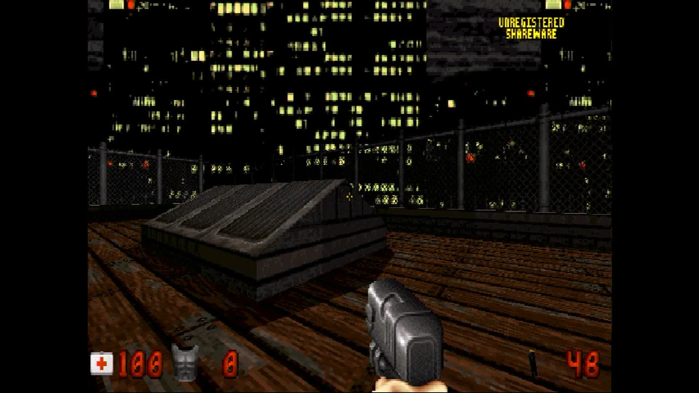

# pi-eduke32

**Duke Nukem 3D on a bare-metal Raspberry Pi.** No Linux, no desktop, no
window manager. The board powers on, the firmware loads one file, and that
file is the game.

This repository contains only the part that makes that possible: a small
kernel that starts the board, a layer that gives the game the operating
system calls it expects, and a build that compiles EDuke32 against them.
EDuke32 itself is included as a submodule and is never modified.

## What you need before anything works

**A `DUKE3D.GRP` file.** This is the game's data — every level, texture,
sound and piece of music. It is not in this repository and never will be,
because it is not ours to give away.

There are two kinds of GRP:

- **The shareware GRP.** Duke Nukem 3D's first episode was released as
  shareware in 1996 and its data file may be freely copied and shared. This
  is the one to use if you do not own the game. It is about 11 MB and
  contains the first episode, *L.A. Meltdown*. `make media` fetches this one
  for you — see [Game data, and `make media`](#game-data-and-make-media)
  below.
- **The full GRP**, from a copy of the game you bought. It contains all the
  episodes. This one is not fetched by anything here; you supply it.

Either one works. Run `make card` and it ends up in the game's directory on
the card (see [The card](#the-card) below).

**Nothing in this project circumvents a licence, a paywall or a shop.** The
full GRP is a commercial product; if you do not have it, use the shareware
GRP or supply your own.



*Captured from the Pi 5's HDMI output. The board is running this image and
nothing else — no kernel underneath it, no window system, no launcher.*

## What works

Duke Nukem 3D plays, drawn by the original 1996 software renderer — the one
its own documentation calls *classic*, and the one the game was designed
around. The two later OpenGL renderers are not built, because there is no
OpenGL on this board.

- **Picture.** 640x480, scaled to your screen. That is the smallest size the
  engine accepts.
- **Music.** The game's own OPL3 emulation plays the MIDI music from the GRP.
- **Keyboard and mouse.** Both, including mouse-look.

What is missing:

- **Multiplayer.** Single player only.
- **The startup settings window.** EDuke32 normally shows one before the game
  begins; settings come from the configuration file on the card instead.
- **The replacement music formats and the video cutscenes.** Ogg, FLAC and
  tracker music are not built, and neither is the VP8 cutscene player — it is
  part of the OpenGL path.

## Building

You need the Arm GNU `aarch64-none-elf` cross compiler, release 15.2.Rel1.
Put its `bin/` on your `PATH`, unpack it into `toolchains/`, or point
`RAPI_TOOLCHAIN_DIR` at it.

```
git clone --recursive https://github.com/Xalior/pi-eduke32.git
cd pi-eduke32
make deps          # long: builds newlib and libc++ from source, three times
make kernels       # the Pi 3, Pi 4 and Pi 5 images
make verify        # checks each image exists and is not empty
```

`make deps` builds three complete C library worlds, one per board, because
each is compiled for its own processor and an image is never portable
between boards. It takes a long time and a lot of disk. On a machine that
cannot hold all three, build one:

```
make deps-rpi4
make rpi4
```

## Game data, and `make media`

**This repository ships no game data, and `make card` never downloads
anything.** Two directories, and the difference between them matters:

| | |
|---|---|
| `media/` | Where game data lives on your machine. `make media` downloads into it; you copy your own files into it by hand. It is never committed and never shipped. |
| `build/sd-card/` | What `make card` stages. It **copies from `media/`** and fetches nothing. |

`make card` works whether or not `media/` has anything in it. A card built
with no data is a real card — it just says plainly that the GRP is missing.

```
make media
```

fetches exactly one file, with `curl`:

**`DUKE3D.GRP`** — the shareware release of Duke Nukem 3D's first episode,
*L.A. Meltdown*, version 1.1. 3D Realms distributed it free of charge in
1996, and eduke32's own project still points to it as the legitimate
no-cost way to run the engine:

```
https://archive.org/download/3D_Realms_Duke_Nukem_3D_Shareware/3D%20Realms%20-%20Duke%20Nukem%203D%20%28Shareware%20Version%29.zip
```

What arrives is checked against two hashes: the MD5 published independently
of this download — it is the well-documented checksum of the v1.1 shareware
GRP, listed on eduke32's own wiki FAQ — and a SHA256 computed from the file
this project fetched, so a later fetch is known to be identical. If either
does not match, the target stops rather than handing you a file to put on a
card. A `provenance.txt` is written beside it recording the URL, the date,
the licence and both hashes. Running it again re-verifies what is already
there instead of downloading it a second time.

**The full, commercial GRP is not fetched by anything here.** If you own
Duke Nukem 3D — GOG or Steam both sell *Duke Nukem 3D: 20th Anniversary
World Tour*, DRM-free once installed — copy your own `DUKE3D.GRP` into
`media/`. `make card` picks it up from there, in place of the shareware one.

Read this section before you run it. It is your machine and your
responsibility.

## The card

```
make card
```

stages the whole card into `build/sd-card/`:

```
kernel8.img              the Pi 3 image
kernel8-rpi4.img         the Pi 4 image
kernel_2712.img          the Pi 5 image
config.txt               tells the firmware which image this board boots
cmdline.txt              boot settings
games/eduke32/           the game's own directory, including DUKE3D.GRP if
                          media/ holds one
```

Copy that onto a FAT-formatted card together with the Raspberry Pi firmware
files, and boot it. If `media/` held no GRP, `make card` says so plainly —
put one in `games/eduke32/DUKE3D.GRP` on the card by hand before booting it.

Everything the game reads or writes stays inside `games/eduke32/`. One card
can carry several of these games, and each keeps to its own directory so
that two of them never overwrite each other's settings.

### Keyboard layout

The card's `cmdline.txt` carries the system's keyboard layout. Circle, the bare-metal framework beneath Duke Nukem 3D, reads this setting at boot and defaults to US. To use a different layout, add `keymap=` to the file:

    keymap=uk

Available layouts: `us` (default), `uk`, `de`, `es`, `fr`, `it`, `dv` (Dvorak). A card built by `make card` has no preset layout — you add one when you write the card if your keyboard is not US.

## Where the source comes from

EDuke32 is included as a submodule from
**`https://voidpoint.io/terminx/eduke32.git`**, the project's own GitLab
server. This is the repository EDuke32 publishes as its source and the one
its own website points at.

The project's history began in Subversion, and for years the Subversion
server was the only place the source lived. It has since moved to Git on the
server above, which carries that whole history. Copies exist on GitHub, but
they are unofficial mirrors that lag behind, so this project uses the
project's own server rather than a mirror of it.

The graphics layer, `circle-libsdl2`, is a submodule as well. It provides an
SDL2 interface on top of Circle, a bare-metal environment for the Raspberry
Pi.

Both submodules use `https://` addresses so that anyone can clone this
repository and everything in it without an account.

## Licences

The code this project adds — everything in `host/`, the build files and this
document — is released under the GNU Lesser General Public License, version
3. See [LICENSE](LICENSE).

The parts that come from elsewhere keep their own licences:

- **Duke Nukem 3D's source code** was released by 3D Realms in 2003 under
  the GNU General Public License, version 2.
- **The Build engine** is Ken Silverman's, released in 2000 under its own
  licence. Its terms are in `eduke32/source/build/buildlic.txt`.
- **EDuke32** combines both, and the terms of each apply to the parts they
  cover.
- **Circle**, the bare-metal environment underneath, is released under the
  GNU General Public License, version 3.
- **The game data** — `DUKE3D.GRP` — is not covered by any of these and is
  not distributed here at all.

An image built from this repository combines all of the above, so
redistributing one means honouring every licence involved. Doing that for
yourself is straightforward; this project does not do it for you.
